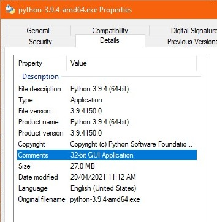

## Introduction
Manta Property Extension is a simple property handler extension for Windows Explorer that allows users (most probably developers) to see whether a Microsoft Portable Executable files like EXE and DLL is 32/64-bit architecture targeted and runs in CUI/GUI mode within Details pane's Comments section of the file's properties dialog. Besides these formats, object files (.obj and .o) and library files (.lib and .a) are also supported.

For more information, please visit: http://sanje2v.wordpress.com/2013/12/10/writing-property-handler-for-windows-explorermanta-property-extension/

## Installation
Setup program for binaries is available in 'Setup' folder inside this repository.

## License
> This software can be used and redistributed royalty-free as well as used derivatively in another non-commercial work without permission from original author. The original author claims no liability of damage and provides no guarantee in providing this software. Any commercial usage of any part of this work without explicit permission from the original author is prohibited.